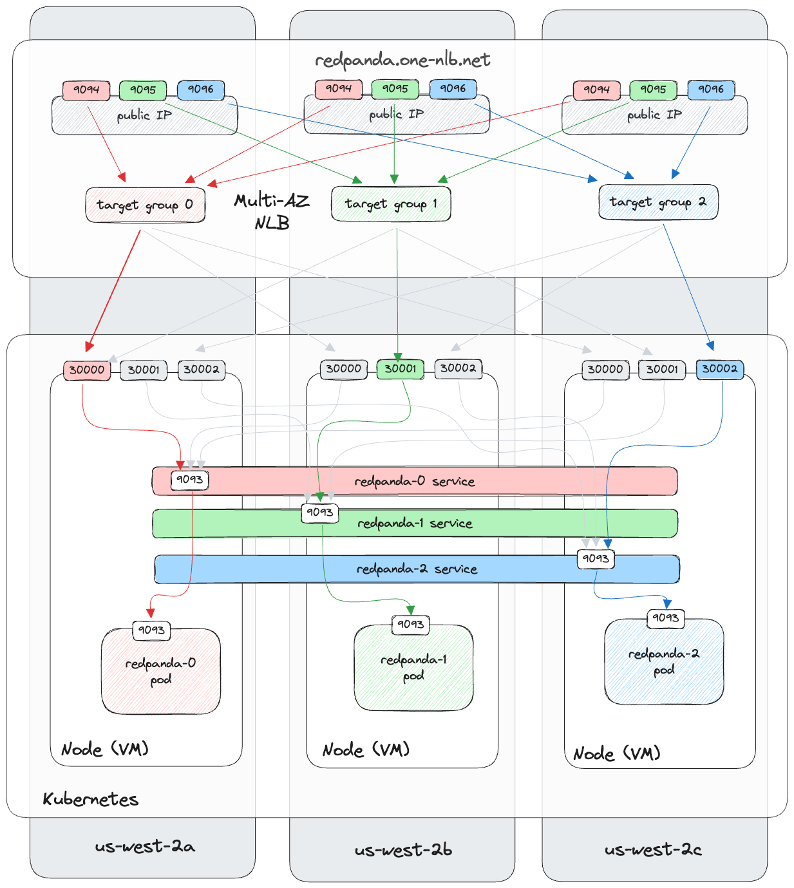

# Overview

This [Redpanda Labs](https://github.com/redpanda-data/redpanda-labs) project provides a demonstration for adding a Network Load Balancer to an existing Redpanda cluster running in EKS. It uses Terraform to determine the VPC and Subnets in use by the named EKS cluster, then creates the additional infrastructure.

Work performed:

- VPC and public subnets identified
- Installation of AWS Load Balancer Controller (via Helm)
- Upload of local certificate into AWS ACM
- Creation of NLB, Target Groups and Listeners
- Creation of Kubernetes Services (NodePort)
- Creation of Target Group Bindings

# Architecture

The deployment architecture is shown below:

Points to note:

- The design uses an additional K8s service per broker
- The K8s services use externalTrafficPolicy = local, ensuring that there is no cross-AZ traffic within the cluster (other than the usual raft replication traffic)
- There may be cross-AZ traffic between the NLB and K8s

# Prerequisites

- An EKS cluster running Redpanda
- A TLS certificate, chain and private key for your domain
- AWS access from Terraform

# Post-Install

Create a DNS A record for your domain containing the multiple IP addresses for NLB - see the Terraform outputs for details of the IP addresses to use.